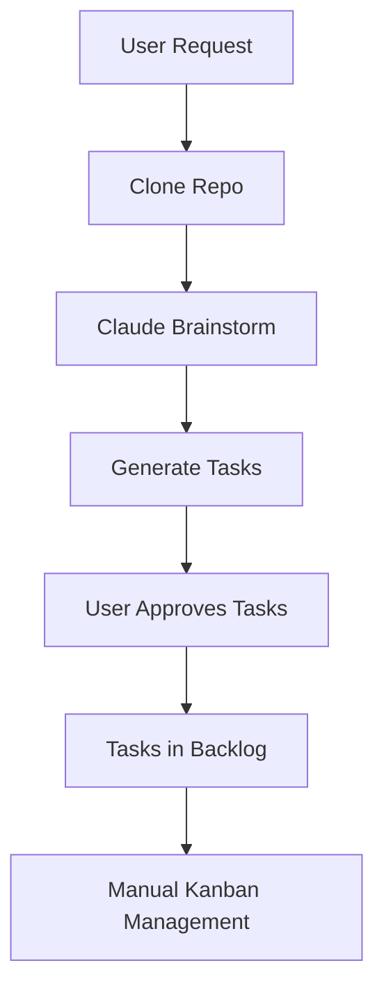
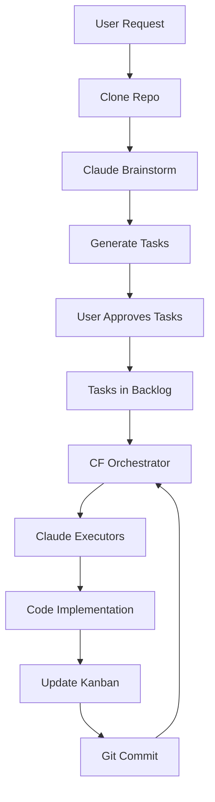

# 🔄 Noderr Complete Flow Status

## The Vision
**Brainstorming → Task Approval → Orchestration → Execution → Completion**

## Current Implementation Status

### ✅ Layer 1: Brainstorming (COMPLETE)
- **Status**: FULLY IMPLEMENTED
- **How it works**:
  - User creates project with git repo → Cloned locally
  - User requests brainstorming → Claude CLI session in tmux
  - Claude analyzes real codebase → Generates 2-4 hour tasks
  - Tasks saved as JSON → Ready for approval
- **No fallbacks**: Claude CLI only - the real thing

### ✅ Layer 2: Task Approval (COMPLETE)
- **Status**: IMPLEMENTED IN UI
- **Features**:
  - `brainstorm.js`: Task approval UI with checkboxes
  - `approvalStatus`: 'approved', 'rejected', 'pending'
  - Bulk approve/reject buttons ("✅ All", "❌ None")
  - Only approved tasks export to backlog
- **Location**: `/docs/brainstorm.js` lines 624-737

### ✅ Layer 3: Task Management (COMPLETE)
- **Status**: KANBAN BOARD WORKING
- **Features**:
  - Backlog, Working, Review, Pushed columns
  - Task creation from brainstorm
  - Drag & drop between columns
  - Progress tracking
- **API**: Full CRUD operations on tasks

### ⚠️ Layer 4: Orchestration (PARTIALLY COMPLETE)
- **Status**: CF WORKER EXISTS BUT NOT CONNECTED
- **What exists**:
  - `/cloudflare-worker/orchestrator.js` - Claude-based orchestrator
  - Noderr methodology embedded (4-step loop)
  - Claude API integration for decisions
- **What's missing**:
  - Not connected to task backlog
  - Not spawning executor sessions
  - Needs deployment and integration

### ❌ Layer 5: Execution (NOT IMPLEMENTED)
- **Status**: NEEDS IMPLEMENTATION
- **What's needed**:
  - Claude CLI executor sessions in tmux
  - Pull tasks from backlog
  - Execute in project directory
  - Update task status
  - Commit code changes
- **Proposed**: Similar to brainstorm but for execution

## What's Working Now



## What The Complete Flow Should Be



## Missing Pieces

### 1. Connect Orchestrator to Backlog
```javascript
// Need in orchestrator.js:
async function pullNextTask() {
    const response = await fetch('http://localhost:3000/api/tasks?status=backlog');
    const tasks = await response.json();
    return tasks[0]; // Get next task
}
```

### 2. Create Executor Script
```bash
# executor-with-claude.sh
PROJECT_PATH=$1
TASK_ID=$2
TASK_DESCRIPTION=$3

tmux new-session -d -s "executor-${TASK_ID}" -c "$PROJECT_PATH"
tmux send-keys -t "executor-${TASK_ID}" "claude" Enter
# Send task to Claude...
```

### 3. Integration Points
- Orchestrator polls for backlog tasks
- Spawns executor Claude sessions
- Updates task status (backlog → working → review)
- Commits code when complete

## Commands to Test Current Flow

```bash
# 1. Start backend
node instant-backend.js

# 2. Create project
curl -X POST http://localhost:3000/api/projects \
  -d '{"name": "Test", "repo": "https://github.com/user/repo.git"}'

# 3. Start brainstorming
curl -X POST http://localhost:3000/api/brainstorm/analyze \
  -d '{"message": "Add feature X", "context": {"projectId": "xxx"}}'

# 4. Check status
curl http://localhost:3000/api/brainstorm/sessions/xxx/status

# 5. View in UI
open http://localhost:3000
# Approve tasks in brainstorm tab
# See tasks in backlog

# 6. What's missing: Automatic execution
# Currently: Manual task management
# Needed: Orchestrator → Executors loop
```

## Summary

### ✅ What's Complete
1. **Brainstorming**: Claude CLI analyzes real repos ✓
2. **Task Generation**: Proper 2-4 hour tasks ✓
3. **Approval UI**: Select which tasks to work on ✓
4. **Kanban Board**: Task management system ✓
5. **Git Integration**: Clone, pull, sync ✓

### ❌ What's Missing
1. **Orchestrator Integration**: Connect CF Worker to backlog
2. **Claude Executors**: Implement task execution sessions
3. **Status Updates**: Auto-update kanban during execution
4. **Git Commits**: Auto-commit completed work
5. **The Loop**: Orchestrator ↔ Executor continuous flow

## The Bottom Line

**80% Complete**: We have brainstorming, approval, and task management.

**Missing 20%**: The automated execution loop (Orchestrator → Executors).

The foundation is solid. The brainstorming is real (Claude CLI only). The approval workflow exists. The kanban board works. We just need to connect the orchestrator and implement executors to complete the autonomous loop.